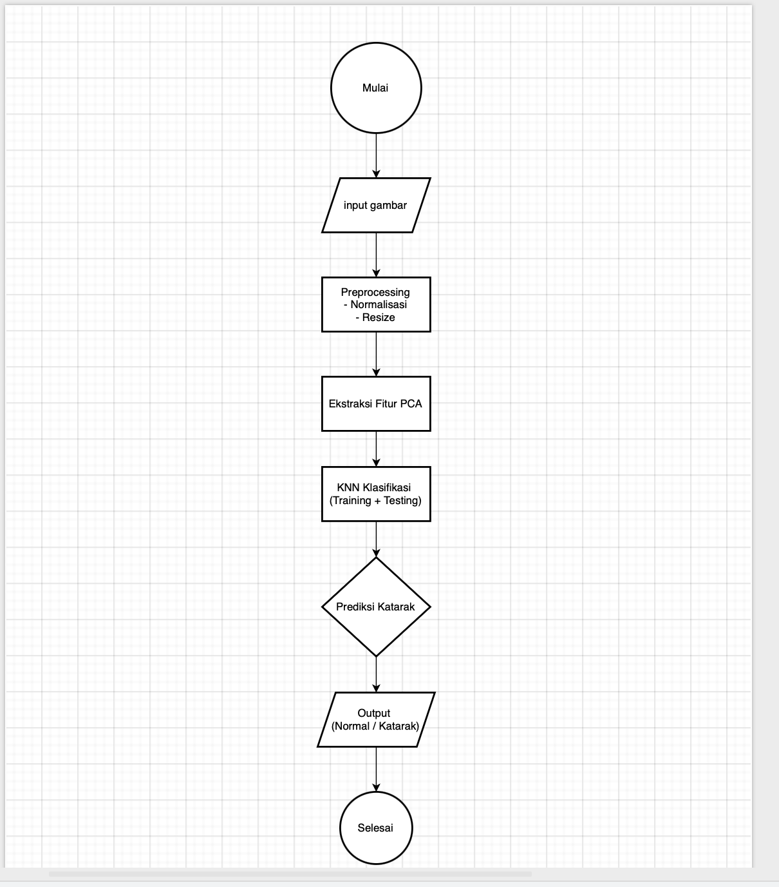

# Klasifikasi Penyakit Mata Katarak Berdasarkan Citra Retina Menggunakan PCA Dan K-NN Berbasis Web

# Deskripsi : 
- Proyek ini mengimplementasikan sistem klasifikasi penyakit mata katarak berbasis web yang menggunakan citra retina (fundus) sebagai input. Fitur inti menggunakan Principal Component Analysis (PCA) untuk ekstraksi/reduksi fitur dan K-Nearest Neighbors (K-NN) sebagai algoritma klasifikasi. Aplikasi ini menyediakan antarmuka web sederhana untuk mengunggah citra retina, menampilkan hasil preprocessing, dan menampilkan prediksi apakah citra menunjukkan tanda katarak atau tidak.

# Fitur : 
- Unggah citra retina melalui antarmuka web.
- Tekan Button Untuk Prediksi Katarak
- Model Melakukan Proses
- Output / Hasil :  Mata normal / Katarak dan nilai Confidence

# Teknologi : 
- Backend : Menggunakan Python (Flask)
- Frontend : Menggunakan Javascript (React JS) dan CSS
- Deployment : Menggunakan Railway.com

# Dataset : 
- https://www.kaggle.com/datasets/nandanp6/cataract-image-dataset

# Cara Instal Dan Gunakan Di localhost :
- git clone https://github.com/DeteksiKatarak/Backend.git
- New Terminal Pada vscode anda
- cd Website_CekKatarak / Projek_Katarak
- cd Backend 
- "python main.py" Untuk menjalankan flask di localhost
- maka akan mendapatkan link "http://192.168.1.5:8080"
- buka browser / postman untuk menampilkan output dari API tersebut

# Link akses online
- https://web-production-d364d.up.railway.app/

# Diagram Flowchart
